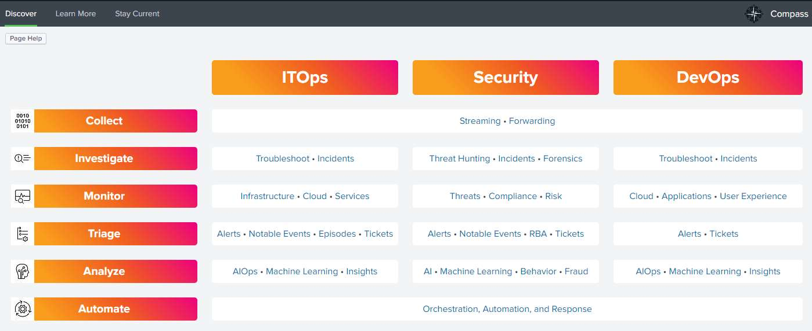
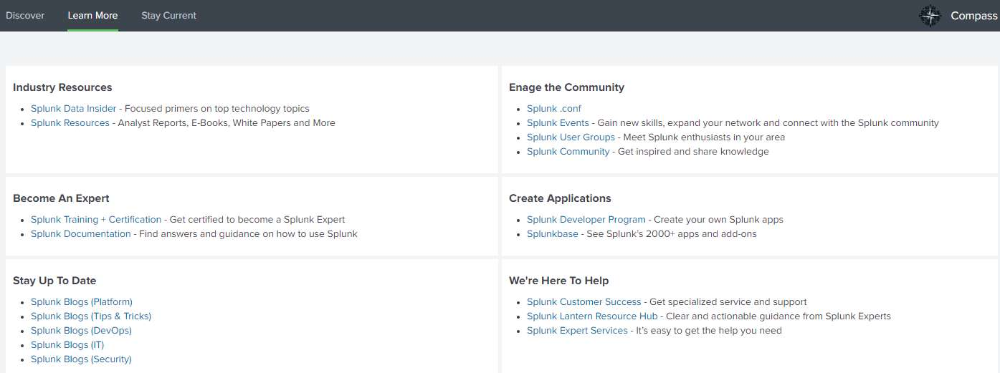

# Splunk Welcome App

This application shows how the Splunk Data-to-Everything&trade; platform helps ITOps, Security, and DevOps teams bring data to every question, decision, and action. The ITOps, Security, and DevOps pillars are broken down into six main activities: collect, investigate, monitor, triage, analyze, and automate; mirroring a common maturity journey across teams.

## Dashboards

There's a lot of information on [Splunk's website](https://splunk.com) and this app presents much of it on the following dashboards.

### Discover

The **Discover** dashboard shows you Splunk's capabilities within the context of ITOps, Security, and DevOps.

### Learn More

The **Learn More** dashboard provides links to main sections of Splunk's website.

### Interests

The **Interests** dashboard provides dynamic content from [splunk.com](https://splunk.com) such as blog posts, events, and .conf presentations.

### Functionality

This app is purely visual and runs no searches. It does pull some content dynamically via JavaScript. Only links and content from [Splunk's website](https://splunk.com) are used in the app.

### Support

This is an open source project with a [public repository](https://github.com/kellewic/splunk-welcome-app). Support is on a best effort basis via [GitHub issues](https://github.com/kellewic/splunk-welcome-app/issues).

